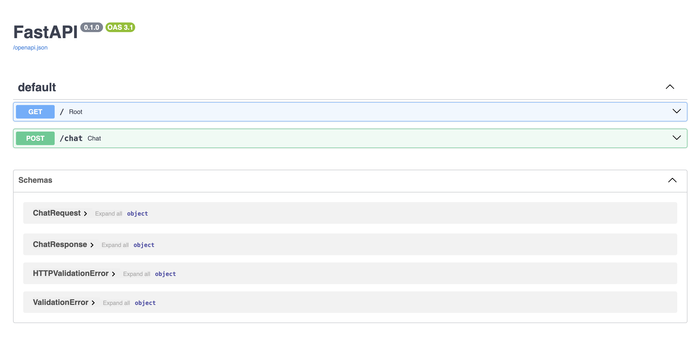
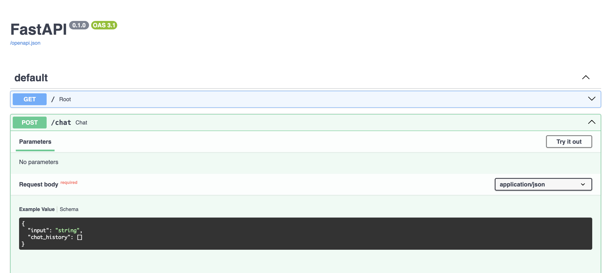
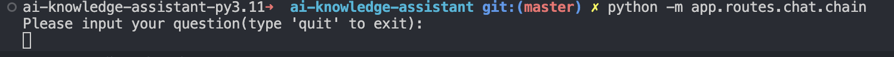

# AiFavs

## 1. 本地运行
### 1.1 安装 poetry
本项目使用 poetry 作为包管理工具，使用 poetry 安装依赖后可以自动创建虚拟环境。如果已经安装了 poetry 可以忽略这一步。通过 pipx 安装：
```
pipx install poetry
```
或者通过 homebrew 安装：
```
brew install poetry
```

### 1.2 安装依赖
在项目根目录，运行以下命令安装依赖：
```
poetry install
```

### 1.3 运行本地服务
安装好依赖后，poetry 会自动创建虚拟环境。现在可以使用 langchain-cli 命令行工具运行服务：
```
langchain serve
```
或：
```
poetry run langchain serve
```
有如下输出说明服务成功运行：
```
INFO:     Will watch for changes in these directories: ['/Users/jiawei.an/code/ai-knowledge-assistant']
INFO:     Uvicorn running on http://127.0.0.1:8000 (Press CTRL+C to quit)
INFO:     Started reloader process [59256] using StatReload
INFO:     Started server process [59260]
INFO:     Waiting for application startup.
INFO:     Application startup complete.
```

## 2. 接口调试
在浏览器输入 http://127.0.0.1:8000/docs 可以查看当前项目中所有接口的文档：


展开接口文档，点击右上角 "try it out" 按钮可以发送请求调试接口：


## 3. 本地运行 chat 脚本
目前项目中有一个 /chat 接口，它接收用户当前的提问和之前的聊天历史作为 context，用 RAG + LLM 输出回答。为方便本地测试，我们可以直接在终端运行脚本来进行问答。在项目根目录运行下面命令：
```
python -m app.routes.chat.chain
```
等待一段时间后，出现下面内容：


然后输入问题即可，输入 quit 退出